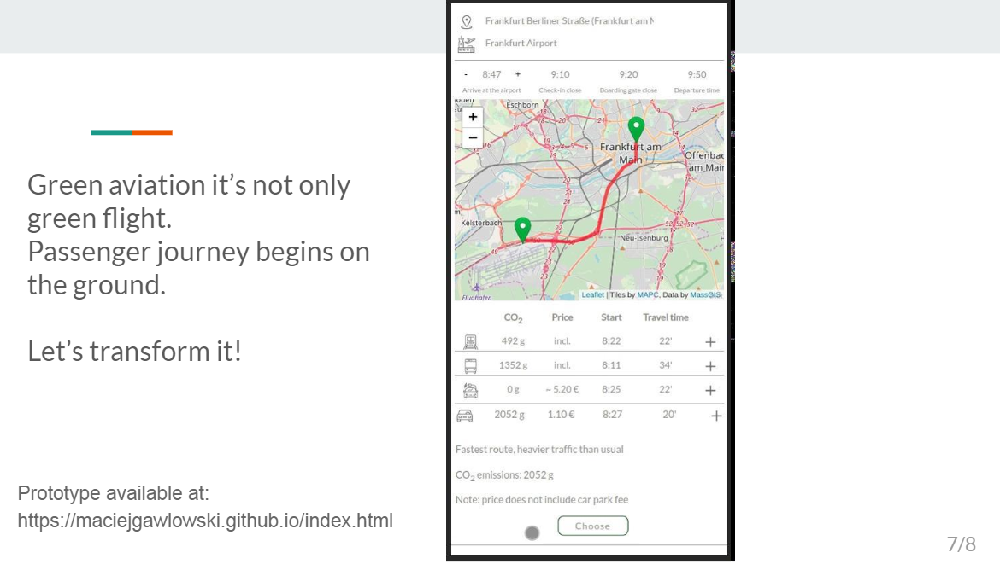

# Hackathon Digital Sky Challenge Application

## What is Digital Sky Challenge?
For the first time, an unprecedented number of aviation partners are joining forces to bring you the Digital Sky Challenge: a 48-hour innovation sprint aiming to create new digital technologies that will help meet the future needs of the European aviation system in terms of capacity, safety, efficiency, and environmental impact. (source: https://www.digitalskychallenge.eu/)

## Application

### Project requirements
- node.js (npm)
- npm install -g gulp-cli 

### Project run
``` 
npm install
gulp
```

### Issue
Our main goal is improvement of Local Air Quality. The reduction of car traffic at the airport is a global imperative due to the number of passengers has been growing at an extremely rapid pace. We focus on the end-to -end journey to help passengers choose the best green option. They don't need money to repay for their CO2 footprint, green choice at the beginnig of the trip has the real value.

### Solution
HackAir app provides passengers more autonomy as they travel. They can get one single ticket for the train, bus and plane in their boarding passes. Public transport is the best green choice but eco car is also possibility. If the plane arrives late and the rail connection is missed, the ticket is automatically rebooked on the next train. Easy planning also with voice interface for busy passengers.





